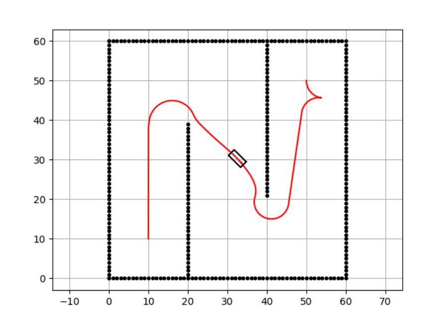

# Hybrid A* Path Planning — Analysis and Simulation

A literature-backed evaluation of the Hybrid A* algorithm, run in the PythonRobotics simulator and assessed against a real industrial use case: mobile robot fleets in the warehouse automation environments I work in at Symbotic.

**Course:** RBT347 Assignment 6.1 · **Tools:** Python, PythonRobotics, primary literature (Dolgov, Thrun, et al.)

## Degree Objective

**Objective 4 — Examine and assess a variety of applications within the field of robotics.**

**How it meets the objective:** It examines a path-planning algorithm in depth and assesses its fit for a real application — warehouse robot fleets — using simulation evidence, not just literature.

## What I Assessed

Hybrid A* extends grid A* by tracking continuous position and heading, expanding nodes through a car-like kinematic model so every path is drivable from the start. The analysis covers its two-heuristic design (obstacle-free kinematic heuristic vs. obstacle-aware 2D dynamic programming heuristic, taking the max of two admissible values), the Reeds-Shepp analytic expansion near the goal, and the trade-offs: loss of strict optimality from discretization, higher compute than 2D planning, and sensitivity to pruning choices.

## Engineering Judgment

Running the simulation surfaced things the papers don't emphasize — including an unexplained reverse maneuver at the goal that I flagged for follow-up rather than hand-waving. The warehouse assessment is concrete: Dolgov's team built Hybrid A* for frequent online replanning against live-updating obstacle maps, which is exactly the operating condition of multi-robot distribution centers where reliable, repeatable motion matters more than mathematically optimal paths.

## Simulation Result

Planned path from (10, 10, 90°) to (50, 50, −90°): the car-like vehicle threads two interior walls with smooth, drivable curvature throughout. The small hook at the goal is the reverse maneuver flagged in the analysis — visible evidence of the Reeds-Shepp expansion choosing a back-in approach to hit the goal heading.



## Reproducing the Simulation

The simulation uses the Hybrid A* demo from [PythonRobotics](https://github.com/AtsushiSakai/PythonRobotics) (Atsushi Sakai et al.):

```
git clone https://github.com/AtsushiSakai/PythonRobotics.git
cd PythonRobotics/PathPlanning/HybridAStar
python3 hybrid_a_star.py
```

Planner run: start (10.0, 10.0, 90°) → goal (50.0, 50.0, −90°), path found with a car-like kinematic model. Python 3.14, matplotlib animation.

## Files

- `hybrid-astar_sim-result.png` — planner output from the PythonRobotics run

## Links

- Portfolio: https://www.garciarobotics.com/
